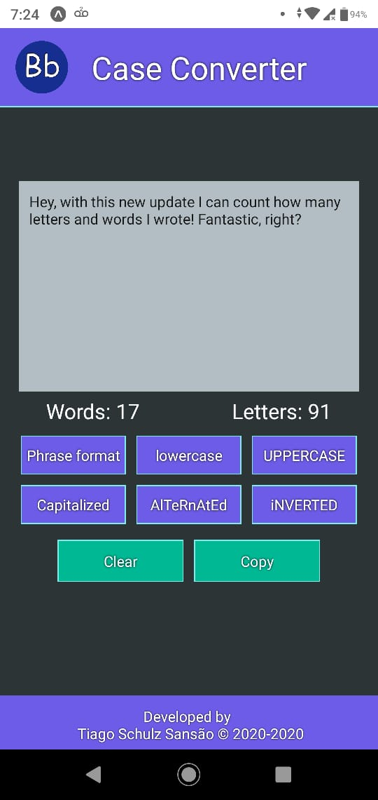
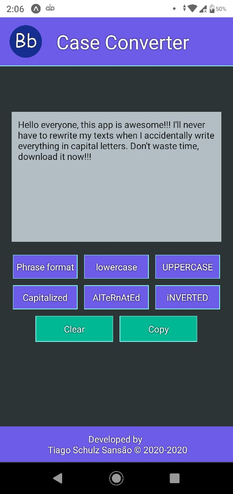

<header>
  

  <h1 align="center"> Case Converter </h1>
  
 
    <strong> A React Native application that is capable of formatting text </strong> 
  

  
 
    <a href="#about">About</a> •
    <a href="#preview">Preview</a> •
    <a href="#instalacao">Getting started</a> •
    <a href="#tecnologias">Technologies</a> 
  

  

</header>
<main>

  

    <h3 align="center">💁 About</h3>
    
Basically with this application you can convert any text you want to what you want, the application also shows how many letters and words were written and currently has six text formats:

    ⚫ Phrase format  
    ⚫ lowercase  
    ⚫ UPPERCASE  
    ⚫ Capitalized  
    ⚫ AlTeRnAtEd  
    ⚫ iNVERTED    
    
This app can be useful at various moments, let's imagine you wrote a redaction and want to be sure that all the letters are capitalized after punctuations or you wrote a whole text in capital letters and don't want to waste your time rewriting everything or you just want to check how many words there are in the text because you were requested to write with a minimum and maximum quantity of words, you can always be in one of these situations, so don't waste your time and <a href="https://play.google.com/store/apps/details?id=com.tiagosansao.convertcase">download it</a> now! 

    
You can download it on Google Play Store <a href="https://play.google.com/store/apps/details?id=com.tiagosansao.convertcase">clicking here!</a>

  

  

  

    <h3 align="center">Preview</h3>
     &nbsp;&nbsp;&nbsp;&nbsp;
    
  

  

  

    <h3 align="center">💻 Getting started</h3>
    
 :warning: It's necessary to have <a href="https://nodejs.org/en/" target="_blank">Node.JS</a> or <a href="https://classic.yarnpkg.com/en/" target="_blank">Yarn</a> installed to be able to proceed from here; 

<ul><li>Instructions</li></ul>
    
    # Clone the repository
    $ git clone https://github.com/TiagoSansao/Case-Converter

    # Go to the directory
    $ cd Case-Converter/

    # Install all the dependencies
    $ yarn install

    # Start the application
    $ expo start

  

  

  

    <h3 align="center">🚀 Technologies</h3>
    <ul>
      <li><a href="https://reactjs.org/">React</a></li>
      <li><a href="https://reactnative.dev/">React-Native</a></li>
      <li><a href="https://docs.expo.io/">Expo</a></li>
    </ul>
  

  

  
 🔥 Developed by Tiago Schulz Sansão  👋  <a href="https://www.linkedin.com/in/tiago-schulz-sans%C3%A3o-9283351b7/">Check my LinkedIn

</main>
